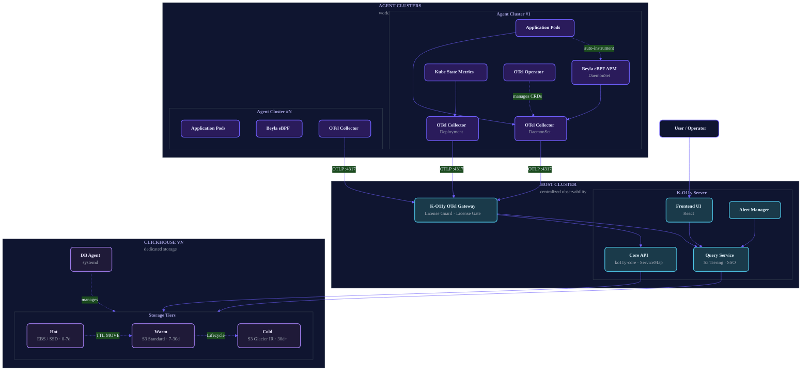

<div align="center">


# K-O11y

**セルフホスト型・エアギャップ・マルチクラスター環境向け Kubernetes 可観測性プラットフォーム**

[English](README.md) | [한국어](README.ko.md) | [日本語](README.ja.md) | [中文](README.zh-CN.md)

[](https://www.repostatus.org/#wip)
[](https://github.com/Wondermove-Inc/k-o11y-server/blob/main/LICENSE)
[](https://github.com/Wondermove-Inc/k-o11y-otel-collector/blob/main/LICENSE)
[](https://github.com/Wondermove-Inc/k-o11y/stargazers)
[](https://github.com/Wondermove-Inc/k-o11y-server/releases)

[OpenTelemetry](https://opentelemetry.io/) · [Beyla eBPF](https://grafana.com/oss/beyla-ebpf/) · [ClickHouse](https://clickhouse.com/) をベースに構築

<br/>


</div>

---

K-O11y は、複数の Kubernetes クラスター全体のメトリクス・ログ・トレースを統合するセルフホスト型の可観測性プラットフォームです。OpenTelemetry + Beyla eBPF ベースの 2 層 Host–Agent アーキテクチャと、ClickHouse によるストレージおよび自動 **Hot → Warm (S3) → Cold (Glacier IR)** ティアリングを提供します。

---

## 📸 スクリーンショット

<div align="center">
  
  <p><em>統合クラスターインサイト — CPU、メモリ、Pod、ノード、トレンドグラフを一画面で確認。</em></p>
</div>

### 🔭 可観測性をひとつの場所に

<table>
  <tr>
    <td width="50%" valign="top">
      
      <p align="center"><strong>📝 Logs</strong><br/><sub>頻度チャート + Severity フィルター + 全文検索</sub></p>
    </td>
    <td width="50%" valign="top">
      
      <p align="center"><strong>🔍 Traces</strong><br/><sub>サービス間の分散トレーシング + 豊富なフィルター</sub></p>
    </td>
  </tr>
  <tr>
    <td width="50%" valign="top">
      
      <p align="center"><strong>📈 APM</strong><br/><sub>p50/p90/p99 レイテンシー、Apdex、主要オペレーション</sub></p>
    </td>
    <td width="50%" valign="top">
      
      <p align="center"><strong>🏗️ Infrastructure</strong><br/><sub>Pod レベルのメトリクス・ログ・トレース・イベント</sub></p>
    </td>
  </tr>
</table>

### 🐞 Exceptions

<div align="center">
  
  <p><em><code>spanID</code> と <code>traceID</code> が付与されたスタックトレースをキャプチャ — 例外から分散トレースへ直接ジャンプできます。</em></p>
</div>

### 💾 Data Lifecycle

<div align="center">
  
  <p><em>シグナルごとの保持期間設定と、UI から構成できるネイティブの <strong>Hot → Warm (S3) → Cold (Glacier IR)</strong> ティアリング。</em></p>
</div>

### 🔔 Alerts

<div align="center">
  
  <p><em>Alertmanager の設定、SMTP、プラガブルな通知チャンネル — すべて UI から設定可能。</em></p>
</div>

---

## ✨ 主な機能

- 📊 **統合可観測性** — メトリクス、ログ、トレースをひとつのプラットフォームで
- 🗺️ **ServiceMap** — マイクロサービスの依存関係トポロジーの可視化
- 🔍 **分散トレーシング** — ClickHouse ベースのトレースストレージとクエリ
- ⚡ **ゼロコード計装** — [Beyla eBPF](https://grafana.com/oss/beyla-ebpf/) によるコード変更不要の自動計装
- 🏷️ **CRD ラベル自動エンリッチメント** — Kubernetes CRD ラベル（例: Argo Rollouts の `k8s.rollout.name`）をすべてのテレメトリーに自動付与
- 🏢 **マルチクラスターネイティブ** — 2 層 Host-Agent アーキテクチャによるフリート全体の可観測性
- 💾 **S3 3 層ストレージ** — Hot (EBS) → Warm (S3 Standard) → Cold (S3 Glacier IR) の自動ティアリング
- 🔐 **SSO テナント自動バインド** — JWT ベースのマルチテナント SSO と自動ワークスペースバインディング
- 🔒 **エアギャップ対応** — 完全オフライン環境でも動作（規制産業向け）
- 📦 **セルフホスト** — データがインフラの外に出ることはありません
- 🎫 **License Guard** — RS256 JWT ベースのライセンス検証と設定可能な猶予期間（エンタープライズ配布向け）

---

## 🎯 なぜ K-O11y なのか？

K-O11y は特定のギャップを埋めるために生まれました。**本番レベルの可観測性が必要だが SaaS を利用できないチーム** — 規制産業、エアギャップ環境、マルチクラスターフリート、またはベンダーロックインを避けたいチームのためのソリューションです。

| ニーズ | SaaS（Datadog 等） | DIY（Prom + Grafana + Jaeger + Loki） | K-O11y |
|------|---|---|---|
| セルフホスト | ❌ | ✅ | ✅ |
| エアギャップ | ❌ | ⚠️ 困難 | ✅ |
| マルチクラスター（Host-Agent） | ✅（有料） | ⚠️ DIY フェデレーション | ✅ 組み込み |
| メトリクス + ログ + トレース統合 | ✅ | ❌ 4 ツール | ✅ |
| eBPF 自動計装 | 部分的 | ⚠️ DIY | ✅ Beyla 統合済み |
| コスト予測可能性 | ❌ 使用量ベース | ✅ | ✅ |
| 運用複雑度 | ✅ 低 | ❌ 高 | ⚠️ 中 |

**最適なユースケース**: オンプレミス K8s 運用チーム、政府機関 / 防衛 / 金融 / 医療、エッジ配置、Datadog からの移行を検討しているコスト重視のチーム。

---

## 🎬 デモ

<div align="center">

https://github.com/user-attachments/assets/097a958c-0179-4676-85d9-5de9d649c711

</div>

---

## 🏗️ アーキテクチャ

K-O11y は **2 層 Host-Agent モデル**を採用しています。各ワークロードクラスターの軽量 Agent コレクターが OTLP 経由でテレメトリーを中央の Host クラスターに送信し、Host クラスターがすべての保存・クエリ・可視化を担います。ClickHouse はストレージティアリングの制御のため、クラスター外の専用 VM に配置されます。



**データフロー**:

1. アプリがテレメトリーを送信（または Beyla eBPF が自動計装 — コード変更不要）
2. 各 Agent クラスターの OTel Collector が K8s + CRD ラベルでエンリッチし、バッチ処理後に OTLP gRPC で転送
3. Host の K-O11y Gateway がライセンス（RS256 JWT）を検証し、License Gate Processor を経て ClickHouse に保存
4. 専用 VM 上の ClickHouse がデータを Hot → Warm → Cold へ自動ティアリング；systemd の DB Agent が S3 Lifecycle と Glacier バックアップを管理
5. ユーザーは Web UI でデータを探索

---

## 📦 コンポーネント

K-O11y は 4 つのリポジトリで構成されており、本リポジトリに git submodule として含まれています。

| コンポーネント | リポジトリ | 説明 |
|-----------|-----------|-------------|
| 🧠 **Server** | [k-o11y-server](https://github.com/Wondermove-Inc/k-o11y-server) | セルフホスト型可観測性バックエンド。`packages/core`（ServiceMap および S3 Tiering Go API、Go 1.24 + Gin + ClickHouse）と `packages/signoz`（React フロントエンドおよび Query Service）のモノレポ構成。 |
| 📦 **Install** | [k-o11y-install](https://github.com/Wondermove-Inc/k-o11y-install) | 6 つの Helm チャート（`k-o11y-host`、`k-o11y-agent`、サブチャート 4 つ: `k-o11y-otel-agent`、`k-o11y-apm-agent`、`k-o11y-ksm`、`k-o11y-otel-operator`）+ Go CLI ツール 2 種: `k-o11y-db`（ClickHouse VM インストール、DDL 適用、S3 ティアリング）、`k-o11y-tls`（cert-manager セットアップ: existing / self-signed / private-CA / Let's Encrypt）。 |
| 📡 **OTel Collector** | [k-o11y-otel-collector](https://github.com/Wondermove-Inc/k-o11y-otel-collector) | OTel Collector v0.109.0 カスタムディストリビューション。**CRD Processor** 搭載 — K8s Informer を通じて Kubernetes CRD ラベル（例: Argo Rollouts の `k8s.rollout.name`）をトレース・メトリクス・ログに自動付与。Knative、KEDA 等にも拡張可能。 |
| 🛂 **OTel Gateway** | [k-o11y-otel-gateway](https://github.com/Wondermove-Inc/k-o11y-otel-gateway) | 2 つのカスタムコンポーネントを持つ OTel Collector ディストリビューション: **License Guard Extension**（RS256 JWT ライセンス検証 + 7 日間猶予期間）と **License Gate Processor**（ライセンス無効かつ猶予期間終了時にテレメトリーをドロップ）。 |

**サブモジュールを含むクローン:**

```bash
git clone --recurse-submodules https://github.com/Wondermove-Inc/k-o11y.git
```

---

## 🚀 クイックスタート

> Host + Agent の完全インストールは、Go CLI ツールと Helm を使用した **6 ステップのプロセス**です。
> 事前ビルド済みの Docker イメージと OCI レジストリ Helm チャートはまだ公開されていないため（[ロードマップ](#-ロードマップ)参照）、現時点では自前の OCI レジストリ（GHCR、Harbor 等）にビルド済みイメージをプッシュする必要があります。

### 前提条件

- **ClickHouse VM**: Ubuntu 22.04 LTS、sudo 権限付き SSH アクセス、8+ vCPU、32GB+ RAM
- **Host K8s クラスター**: Kubernetes 1.28+、Helm 3.12+、kubectl
- **Agent K8s クラスター**: Kubernetes 1.28+、Linux カーネル 5.8+（Beyla eBPF 用）
- **OCI レジストリ**: 両クラスターからアクセス可能であること
- **暗号化キー**: `openssl rand -hex 32`（`K_O11Y_ENCRYPTION_KEY` として保存）

### 最小インストールフロー（6 ステップ）

```bash
# ── 1. VM 上に ClickHouse + Keeper をインストール（Go CLI）
./k-o11y-db install --mode ssh \
  --ssh-user <SSH_USER> --ssh-key <SSH_KEY_PATH> \
  --keeper-host <KEEPER_IP> --clickhouse-host <CLICKHOUSE_IP> \
  --clickhouse-password '<CLICKHOUSE_PASSWORD>' \
  --encryption-key <K_O11Y_ENCRYPTION_KEY> --yes

# ── 2.（任意）OTel Gateway の TLS を設定
./k-o11y-tls setup --mode selfsigned \
  --domain <DOMAIN> --secret-name k-o11y-otel-collector-tls \
  --kube-context <HOST_CONTEXT>

# ── 3. Host クラスターをインストール（Helm）
helm upgrade --install k-o11y-host \
  --kube-context <HOST_CONTEXT> \
  oci://<YOUR_REGISTRY>/charts/k-o11y-host \
  --namespace k-o11y --create-namespace \
  --set externalClickhouse.host=<NLB_DNS_OR_IP> \
  --set externalClickhouse.password='<CLICKHOUSE_PASSWORD>' \
  --set o11yHub.additionalEnvs.K_O11Y_ENCRYPTION_KEY=<ENCRYPTION_KEY>

# ── 4. DDL 適用 + ClickHouse VM に OTel Agent をインストール（Go CLI）
./k-o11y-db post-install --mode ssh \
  --clickhouse-host <CLICKHOUSE_IP> \
  --clickhouse-password '<CLICKHOUSE_PASSWORD>' \
  --otel-endpoint <HOST_GATEWAY_IP>:4317 --environment prod

# ── 5. Agent クラスターに cert-manager をインストール（Helm）
helm install cert-manager jetstack/cert-manager \
  --namespace cert-manager --create-namespace \
  --version v1.17.1 --set crds.enabled=true \
  --kube-context <AGENT_CONTEXT> --wait

# ── 6. Agent クラスターをインストール（Helm）
helm upgrade --install k-o11y-agent \
  --kube-context <AGENT_CONTEXT> \
  oci://<YOUR_REGISTRY>/charts/k-o11y-agent \
  --namespace k-o11y --create-namespace \
  --set global.clusterName=<CLUSTER_NAME> \
  --set global.deploymentEnvironment=prod \
  --set k-o11y-otel-agent.otelCollectorEndpoint=<HOST_GATEWAY_IP>:4317 \
  --wait --timeout 25m
```

**完全なリファレンス**（すべてのフラグ、TLS バリアント、bastion SSH モードを含む）: [k-o11y-install/README.md](https://github.com/Wondermove-Inc/k-o11y-install#readme)

---

## 🛠️ インストール

セットアップに応じて、3 種類のインストールシナリオがあります。

### 1. フルスタック — 自前ビルドイメージ（現在利用可能）⚙️

上記の 6 ステッププロセスがこれにあたります。各サブリポジトリをクローンし、Docker イメージをビルドして**自前の OCI レジストリ**にプッシュした後、そのレジストリを参照する Helm チャートでインストールします。

各サブリポジトリの README に完全なビルド手順が記載されています:
- **Server**: [packages/core](https://github.com/Wondermove-Inc/k-o11y-server/tree/main/packages/core) および [packages/signoz](https://github.com/Wondermove-Inc/k-o11y-server/tree/main/packages/signoz) — `go build` / `make go-build-community` / `docker build`
- **OTel Collector**: `make docker` → `ghcr.io/wondermove-inc/k-o11y-otel-collector-contrib:0.109.0.1` にプッシュ
- **OTel Gateway**: `go build -o signoz-otel-collector ./cmd/signozotelcollector` + Docker

### 2. GHCR 事前ビルドイメージ（ロードマップ）🚧

GHCR への自動パブリッシングが実現すれば（[ロードマップ](#-ロードマップ)参照）、インストールは以下のように簡単になります:

```bash
helm install k-o11y oci://ghcr.io/wondermove-inc/charts/k-o11y-host \
  --namespace k-o11y --create-namespace
```

現時点では利用できません。

### 3. ローカル開発

- **Server（core API）**: `cd packages/core && go run cmd/main.go`（`CLICKHOUSE_HOST`、`CLICKHOUSE_PORT`、`CLICKHOUSE_DATABASE` が必要）
- **Server（バックエンド）**: `cd packages/signoz && make go-run-community`
- **Frontend**: `cd packages/signoz/frontend && yarn install && yarn dev`

---

## 🗺️ ロードマップ

確定したコミットメントではなく、方向性です。どの項目への貢献も歓迎します。

- [ ] 🐳 **4 コンポーネント全ての GHCR Docker イメージ公開**（ワンライン インストールを実現）
- [ ] 📦 **OCI レジストリへの Helm チャート公開**（現在は `<YOUR_REGISTRY>` プレースホルダー）
- [ ] 🏗️ **MkDocs / GitHub Pages ドキュメントサイト**
- [ ] 🌏 **Go コード内の韓国語コメントを英語に翻訳**（[k-o11y-server#1](https://github.com/Wondermove-Inc/k-o11y-server/issues/1)、[k-o11y-install#1](https://github.com/Wondermove-Inc/k-o11y-install/issues/1)）
- [ ] 🧪 **ローカル開発用 docker-compose.yml**
- [ ] 📚 **Grafana ダッシュボード JSON プリセット**
- [ ] 🔔 **Prometheus AlertManager ルールプリセット**

---

## 🤝 コントリビューション

コントリビューションを歓迎します。特に [good first issue](https://github.com/search?q=org%3AWondermove-Inc+label%3A%22good+first+issue%22+is%3Aopen&type=issues) からの参加をお待ちしています。

1. **イシューを探す** — `good first issue` または `help wanted` ラベルが付いたイシューを確認
2. **イシューにコメント** — 重複作業を避けるため、担当する旨を宣言してください
3. **フォーク → ブランチ → PR** — スコープは狭く、説明は明確に
4. **レビューへの対応** — メンテナーが数日以内に返答します

詳細は各サブリポジトリの [CONTRIBUTING.md](https://github.com/Wondermove-Inc/k-o11y-server/blob/main/CONTRIBUTING.md) をご参照ください。

本プロジェクトは**パッシブメンテナンス**モデルを採用しています — PR とイシューは時間の許す限りレビューされます。7 日以内の返答を目標としていますが、保証はできません。

---

## 👥 コントリビューター

K-O11y をより良いプロジェクトにしてくださったすべての方に感謝します。

<a href="https://github.com/Wondermove-Inc/k-o11y/graphs/contributors">
  
</a>

_上記のコントリビューター一覧はこの umbrella リポジトリのものです。全サブリポジトリを含む完全なリスト:_
[server](https://github.com/Wondermove-Inc/k-o11y-server/graphs/contributors) ·
[install](https://github.com/Wondermove-Inc/k-o11y-install/graphs/contributors) ·
[otel-collector](https://github.com/Wondermove-Inc/k-o11y-otel-collector/graphs/contributors) ·
[otel-gateway](https://github.com/Wondermove-Inc/k-o11y-otel-gateway/graphs/contributors)

---

## ⭐ Star History

K-O11y が役に立つと感じていただけたら、ぜひスターをお願いします — 他のユーザーがプロジェクトを見つける助けになります。

[](https://star-history.com/#Wondermove-Inc/k-o11y&Wondermove-Inc/k-o11y-server&Wondermove-Inc/k-o11y-install&Wondermove-Inc/k-o11y-otel-collector&Wondermove-Inc/k-o11y-otel-gateway&Date)

---

## 📄 ライセンス

- **k-o11y-server** および **k-o11y-install**: [MIT License](https://github.com/Wondermove-Inc/k-o11y-server/blob/main/LICENSE)（SigNoz から継承）
- **k-o11y-otel-collector** および **k-o11y-otel-gateway**: [Apache License 2.0](https://github.com/Wondermove-Inc/k-o11y-otel-collector/blob/main/LICENSE)（OpenTelemetry から継承）

[SigNoz](https://github.com/SigNoz/signoz)（MIT）および [OpenTelemetry Collector](https://github.com/open-telemetry/opentelemetry-collector)（Apache 2.0）からフォーク。帰属の詳細は [NOTICE](NOTICE) を参照してください。

---

## 💬 お問い合わせ

- 🐛 **バグ報告 & 機能リクエスト**: [GitHub Issues](https://github.com/Wondermove-Inc/k-o11y/issues)
- 💭 **質問 & ディスカッション**: イシューをオープンしてください（GitHub Discussions は近日公開予定）
- 🌐 **ウェブサイト**: [www.skuberplus.com](https://www.skuberplus.com)

---

<div align="center">

**[Wondermove](https://www.skuberplus.com) が開発・メンテナンスしています**

</div>
