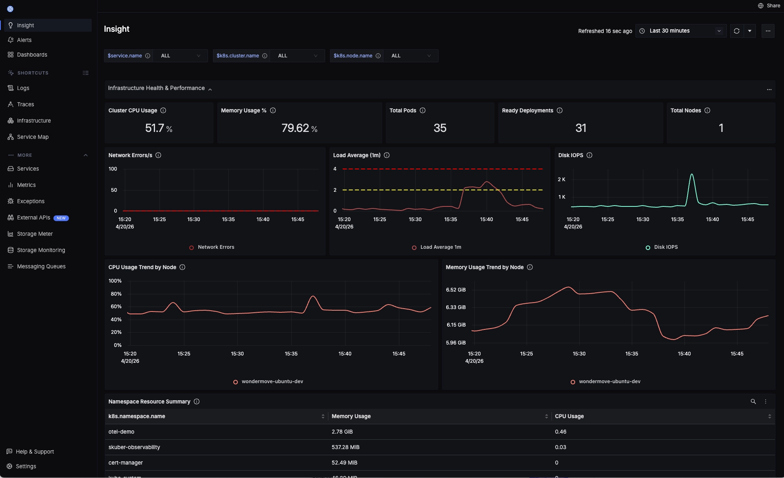
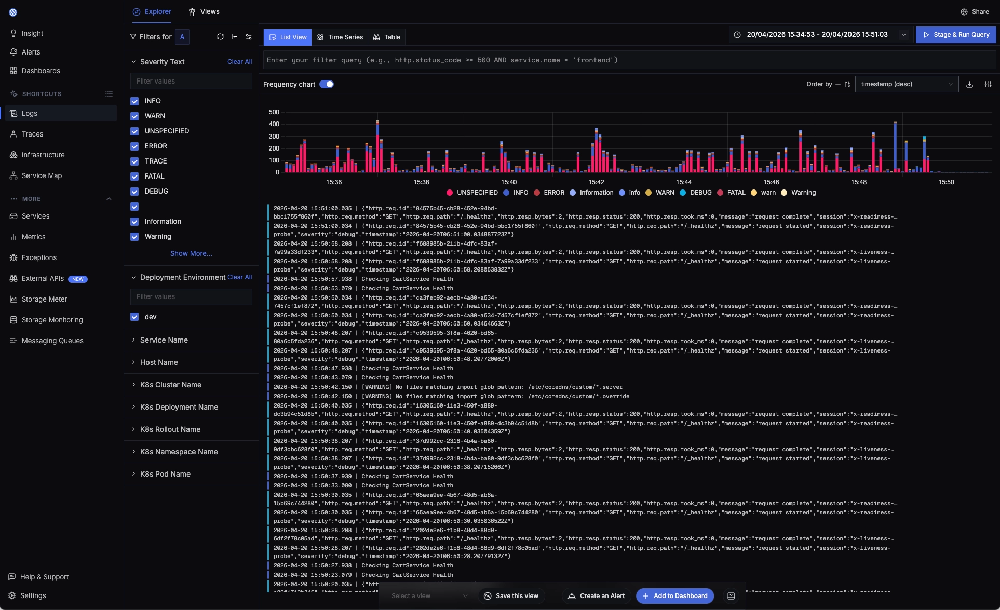
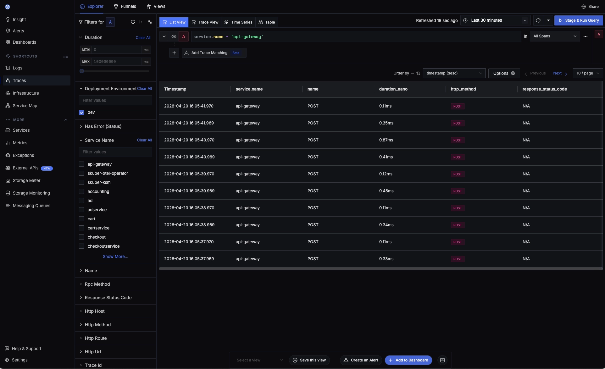
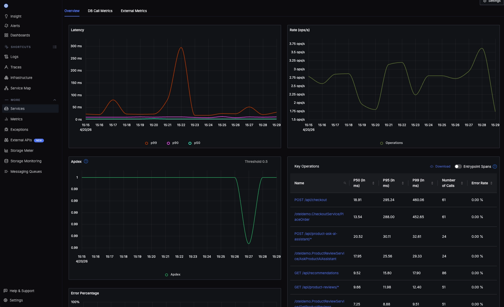
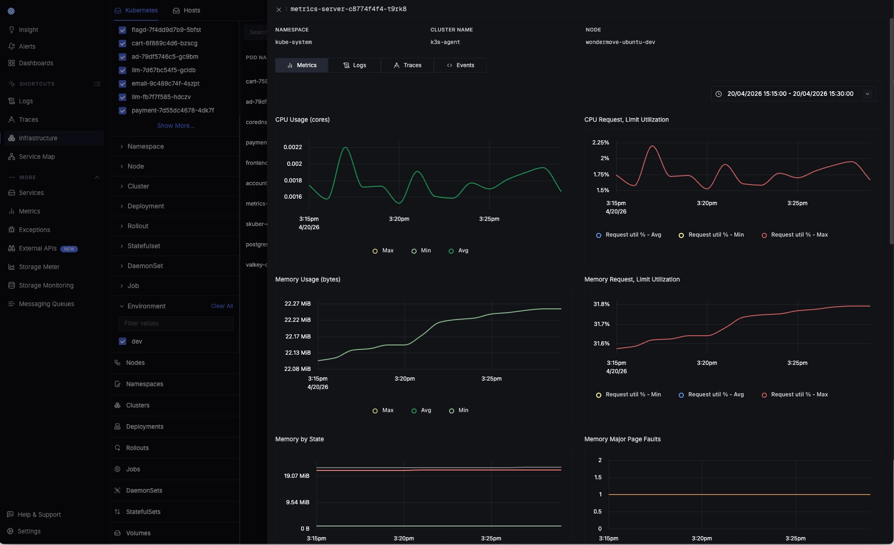
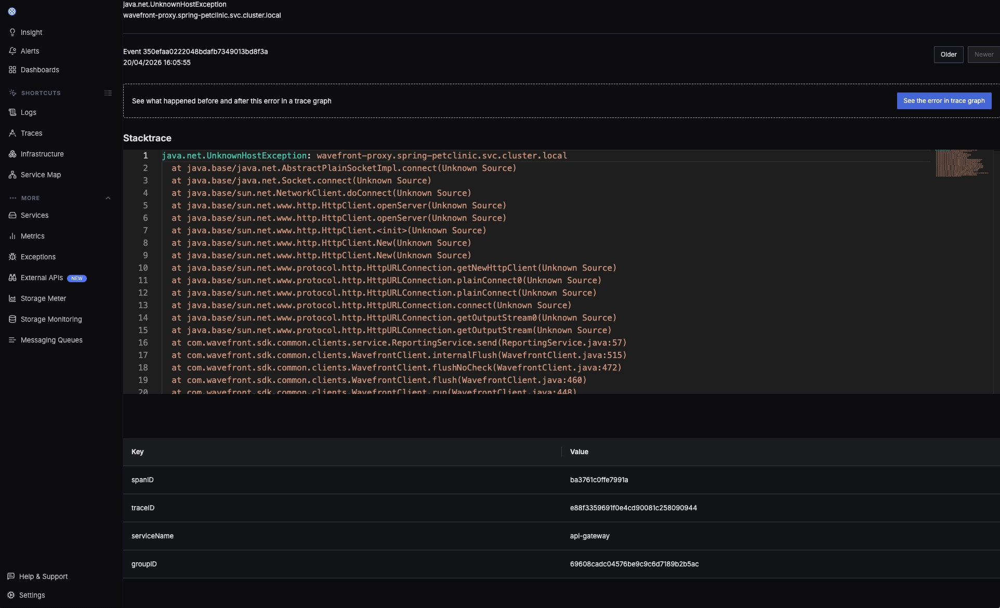
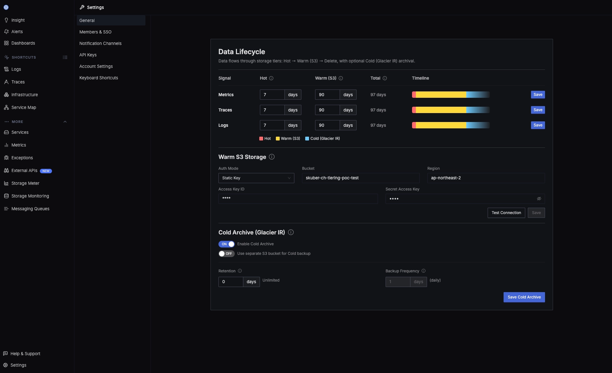
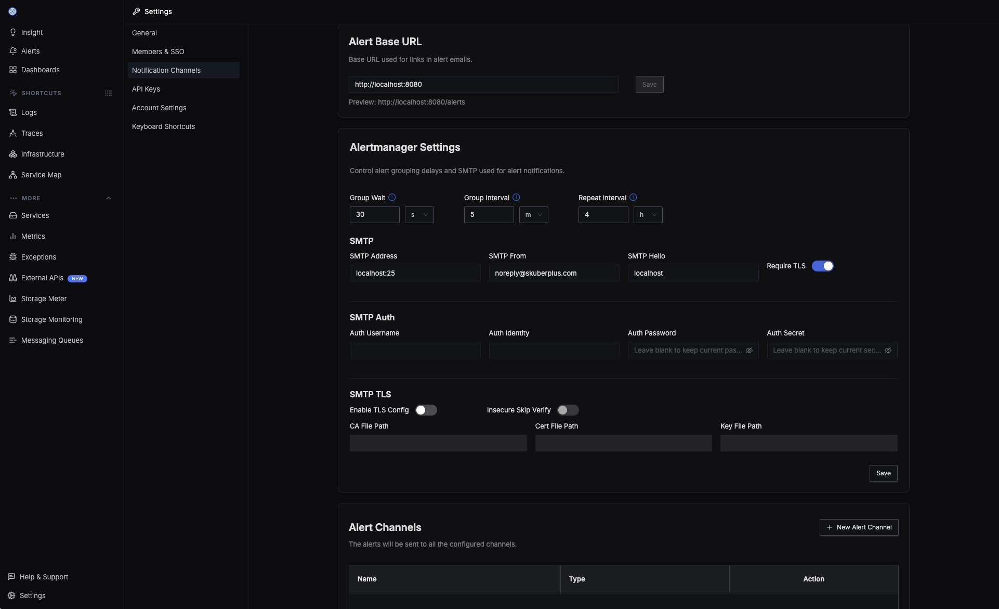
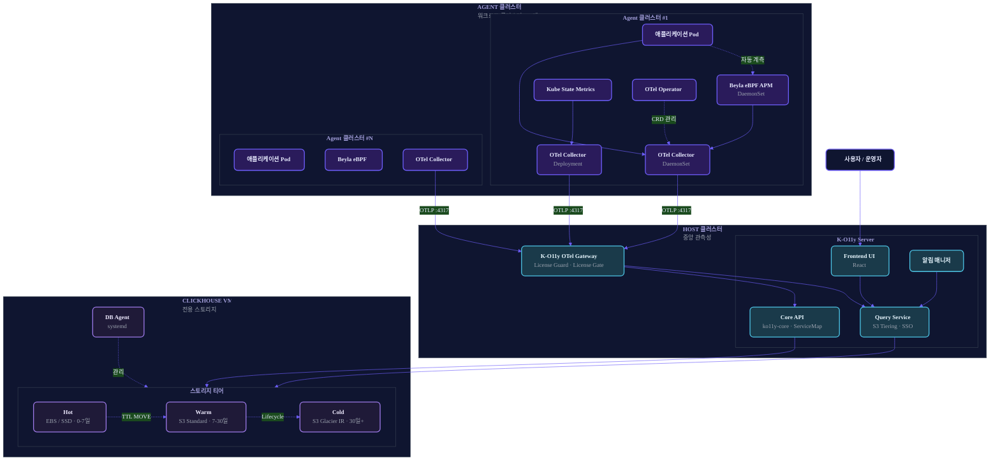

<div align="center">


# K-O11y

**설치형 · Air-gapped · 멀티클러스터 환경을 위한 Kubernetes 관측성 플랫폼**

[English](README.md) | [한국어](README.ko.md)

[](https://www.repostatus.org/#wip)
[](https://github.com/Wondermove-Inc/k-o11y-server/blob/main/LICENSE)
[](https://github.com/Wondermove-Inc/k-o11y-otel-collector/blob/main/LICENSE)
[](https://github.com/Wondermove-Inc/k-o11y/stargazers)
[](https://github.com/Wondermove-Inc/k-o11y-server/releases)

[OpenTelemetry](https://opentelemetry.io/) · [Beyla eBPF](https://grafana.com/oss/beyla-ebpf/) · [ClickHouse](https://clickhouse.com/) 기반

<br/>


</div>

---

## 📸 스크린샷

<div align="center">
  
  <p><em>통합 클러스터 인사이트 — CPU, 메모리, Pod, Node, 트렌드 그래프를 한 화면에.</em></p>
</div>

### 🔭 한 곳에서 모든 관측성

<table>
  <tr>
    <td width="50%" valign="top">
      
      <p align="center"><strong>📝 Logs</strong><br/><sub>빈도 차트 + Severity 필터 + 전문 검색</sub></p>
    </td>
    <td width="50%" valign="top">
      
      <p align="center"><strong>🔍 Traces</strong><br/><sub>서비스 간 분산 트레이싱 + 풍부한 필터</sub></p>
    </td>
  </tr>
  <tr>
    <td width="50%" valign="top">
      
      <p align="center"><strong>📈 APM</strong><br/><sub>p50/p90/p99 레이턴시, Apdex, 주요 오퍼레이션</sub></p>
    </td>
    <td width="50%" valign="top">
      
      <p align="center"><strong>🏗️ Infrastructure</strong><br/><sub>Pod 단위 메트릭 · 로그 · 트레이스 · 이벤트</sub></p>
    </td>
  </tr>
</table>

### 🐞 Exceptions

<div align="center">
  
  <p><em>Exception에 <code>spanID</code>와 <code>traceID</code>가 함께 기록 — 스택트레이스에서 바로 분산 트레이스로 이동.</em></p>
</div>

### 💾 Data Lifecycle

<div align="center">
  
  <p><em>시그널별 보존 기간 설정 + 네이티브 <strong>Hot → Warm(S3) → Cold(Glacier IR)</strong> 티어링을 UI에서 구성.</em></p>
</div>

### 🔔 Alerts

<div align="center">
  
  <p><em>Alertmanager, SMTP, 다양한 알림 채널을 UI에서 설정.</em></p>
</div>

---

## ✨ 주요 기능

- 📊 **통합 관측성** — 메트릭, 로그, 트레이스를 하나의 플랫폼에서
- 🗺️ **ServiceMap** — 마이크로서비스 의존성 토폴로지 시각화
- 🔍 **분산 트레이싱** — ClickHouse 기반 트레이스 저장 및 쿼리
- ⚡ **Zero-Code 계측** — [Beyla eBPF](https://grafana.com/oss/beyla-ebpf/)로 코드 수정 없이 자동 계측
- 🏷️ **CRD 라벨 자동 보강** — Kubernetes CRD 라벨 (예: Argo Rollouts의 `k8s.rollout.name`)을 모든 원격측정 데이터에 자동 추가
- 🏢 **멀티클러스터 네이티브** — 2-tier Host-Agent 아키텍처로 다중 클러스터 통합 관측
- 💾 **S3 3-Tier 스토리지** — Hot(EBS) → Warm(S3 Standard) → Cold(S3 Glacier IR) 자동 티어링
- 🔐 **SSO 테넌트 자동 락** — JWT 기반 멀티 테넌트 SSO + 자동 워크스페이스 바인딩
- 🔒 **Air-Gapped 지원** — 완전 오프라인 환경에서도 동작 (규제 산업 대응)
- 📦 **Self-Hosted** — 데이터가 인프라 밖으로 나가지 않습니다
- 🎫 **License Guard** — RS256 JWT 기반 라이선스 검증 + 설정 가능한 유예 기간 (엔터프라이즈 배포용)

---

## 🎬 Demo

<div align="center">

https://github.com/user-attachments/assets/097a958c-0179-4676-85d9-5de9d649c711

</div>

---

## 🏗️ 아키텍처

K-O11y는 **2-tier Host-Agent 모델**을 사용합니다. 각 워크로드 클러스터의 경량 Agent 수집기가 OTLP로 원격측정 데이터를 전송하면, 중앙 Host 클러스터가 저장·조회·시각화를 담당합니다. ClickHouse는 스토리지 티어링 제어를 위해 전용 VM에 배치됩니다 (클러스터 외부).



**데이터 흐름**:

1. 애플리케이션이 원격측정 데이터를 전송 (또는 Beyla eBPF가 자동 계측 — 코드 수정 불필요)
2. 각 Agent 클러스터의 OTel Collector가 K8s + CRD 라벨을 보강하고 배치 처리 후 OTLP gRPC로 전달
3. Host의 K-O11y Gateway가 라이선스(RS256 JWT) 검증 후 License Gate Processor를 거쳐 ClickHouse에 저장
4. ClickHouse VM이 데이터 age에 따라 Hot → Warm → Cold 자동 티어링; systemd DB Agent가 S3 Lifecycle 및 Glacier 백업 관리
5. 사용자는 웹 UI로 조회

---

## 🎯 왜 K-O11y인가?

K-O11y는 특정 간극을 채우기 위해 만들어졌습니다. **운영 수준의 관측성이 필요하지만 SaaS를 쓸 수 없는 팀** — 규제 산업, 폐쇄망, 멀티클러스터 운영팀, 벤더 종속성을 경계하는 팀을 위한 솔루션입니다.

| 요구사항 | SaaS (Datadog 등) | DIY (Prom + Grafana + Jaeger + Loki) | K-O11y |
|---|---|---|---|
| 설치형 (Self-hosted) | ❌ | ✅ | ✅ |
| Air-gapped | ❌ | ⚠️ 어려움 | ✅ |
| 멀티클러스터 (Host-Agent) | ✅ (유료) | ⚠️ 직접 페더레이션 | ✅ 기본 제공 |
| 메트릭 + 로그 + 트레이스 통합 | ✅ | ❌ 도구 4개 | ✅ |
| eBPF 자동 계측 | 부분 지원 | ⚠️ DIY | ✅ Beyla 통합 |
| 비용 예측 가능성 | ❌ 사용량 기반 | ✅ | ✅ |
| 운영 복잡도 | ✅ 낮음 | ❌ 높음 | ⚠️ 중간 |

**최적 사용처**: 온프레미스 K8s 운영팀, 국방 / 금융 / 의료 / 공공 기관, 엣지 배포, Datadog에서 이전 고려 중인 비용 민감 팀.

---

## 🚀 빠른 시작

> Host + Agent 전체 설치는 Go CLI 도구와 Helm을 사용하는 **6단계 프로세스**입니다.
> 사전 빌드된 Docker 이미지와 OCI 레지스트리 Helm 차트는 아직 배포되지 않았으므로 ([로드맵](#-로드맵) 참고), 현재는 자체 OCI 레지스트리(GHCR, Harbor 등)에 빌드된 이미지를 push해야 합니다.

### 사전 요구사항

- **ClickHouse VM**: Ubuntu 22.04 LTS, sudo SSH 계정, 8+ vCPU, 32GB+ RAM
- **Host K8s 클러스터**: Kubernetes 1.28+, Helm 3.12+, kubectl
- **Agent K8s 클러스터**: Kubernetes 1.28+, Linux kernel 5.8+ (Beyla eBPF용)
- **OCI 레지스트리**: 두 클러스터 모두에서 접근 가능
- **암호화 키**: `openssl rand -hex 32` (`K_O11Y_ENCRYPTION_KEY`로 저장)

### 최소 설치 흐름 (6단계)

```bash
# ── 1. ClickHouse + Keeper VM 설치 (Go CLI)
./k-o11y-db install --mode ssh \
  --ssh-user <SSH_USER> --ssh-key <SSH_KEY_PATH> \
  --keeper-host <KEEPER_IP> --clickhouse-host <CLICKHOUSE_IP> \
  --clickhouse-password '<CLICKHOUSE_PASSWORD>' \
  --encryption-key <K_O11Y_ENCRYPTION_KEY> --yes

# ── 2. (선택) OTel Gateway TLS 설정
./k-o11y-tls setup --mode selfsigned \
  --domain <DOMAIN> --secret-name k-o11y-otel-collector-tls \
  --kube-context <HOST_CONTEXT>

# ── 3. Host 클러스터 설치 (Helm)
helm upgrade --install k-o11y-host \
  --kube-context <HOST_CONTEXT> \
  oci://<YOUR_REGISTRY>/charts/k-o11y-host \
  --namespace k-o11y --create-namespace \
  --set externalClickhouse.host=<NLB_DNS_OR_IP> \
  --set externalClickhouse.password='<CLICKHOUSE_PASSWORD>' \
  --set o11yHub.additionalEnvs.K_O11Y_ENCRYPTION_KEY=<ENCRYPTION_KEY>

# ── 4. DDL 적용 + OTel Agent 설치 (Go CLI)
./k-o11y-db post-install --mode ssh \
  --clickhouse-host <CLICKHOUSE_IP> \
  --clickhouse-password '<CLICKHOUSE_PASSWORD>' \
  --otel-endpoint <HOST_GATEWAY_IP>:4317 --environment prod

# ── 5. Agent 클러스터에 cert-manager 설치 (Helm)
helm install cert-manager jetstack/cert-manager \
  --namespace cert-manager --create-namespace \
  --version v1.17.1 --set crds.enabled=true \
  --kube-context <AGENT_CONTEXT> --wait

# ── 6. Agent 클러스터 설치 (Helm)
helm upgrade --install k-o11y-agent \
  --kube-context <AGENT_CONTEXT> \
  oci://<YOUR_REGISTRY>/charts/k-o11y-agent \
  --namespace k-o11y --create-namespace \
  --set global.clusterName=<CLUSTER_NAME> \
  --set global.deploymentEnvironment=prod \
  --set k-o11y-otel-agent.otelCollectorEndpoint=<HOST_GATEWAY_IP>:4317 \
  --wait --timeout 25m
```

**전체 레퍼런스** (모든 플래그, TLS 변형, bastion SSH 모드 포함): [k-o11y-install/README.ko.md](https://github.com/Wondermove-Inc/k-o11y-install/blob/main/README.ko.md)

---

## 📦 구성 요소

K-O11y는 4개 저장소로 구성되며, 본 레포에는 git submodule로 포함되어 있습니다.

| 구성 요소 | 저장소 | 설명 |
|-----------|-------|------|
| 🧠 **Server** | [k-o11y-server](https://github.com/Wondermove-Inc/k-o11y-server) | 설치형 관측성 백엔드. 모노레포 구성: `packages/core` (ServiceMap 및 S3 Tiering Go API, Go 1.24 + Gin + ClickHouse) + `packages/signoz` (React 프론트엔드와 Query Service). |
| 📦 **Install** | [k-o11y-install](https://github.com/Wondermove-Inc/k-o11y-install) | 6개 Helm 차트 (`k-o11y-host`, `k-o11y-agent`, sub-chart 4개: `k-o11y-otel-agent`, `k-o11y-apm-agent`, `k-o11y-ksm`, `k-o11y-otel-operator`) + Go CLI 도구 2종: `k-o11y-db` (ClickHouse VM 설치, DDL 적용, S3 티어링), `k-o11y-tls` (cert-manager 설정: existing / self-signed / private-CA / Let's Encrypt). |
| 📡 **OTel Collector** | [k-o11y-otel-collector](https://github.com/Wondermove-Inc/k-o11y-otel-collector) | OTel Collector v0.109.0 커스텀 배포. **CRD Processor** 탑재 — K8s Informer 기반으로 Kubernetes CRD 라벨 (예: Argo Rollouts의 `k8s.rollout.name`)을 traces, metrics, logs에 자동 추가. Knative, KEDA 등으로 확장 가능. |
| 🛂 **OTel Gateway** | [k-o11y-otel-gateway](https://github.com/Wondermove-Inc/k-o11y-otel-gateway) | OTel Collector 배포판. 두 가지 커스텀 컴포넌트 포함: **License Guard Extension** (RS256 JWT 라이선스 검증 + 7일 유예 기간), **License Gate Processor** (라이선스 무효 + 유예 기간 종료 시 원격측정 데이터 드롭). |

**서브모듈 포함 클론:**

```bash
git clone --recurse-submodules https://github.com/Wondermove-Inc/k-o11y.git
```

---

## 🛠️ 설치

상황에 따라 세 가지 설치 시나리오가 있습니다.

### 1. 전체 스택 — 자체 빌드 이미지 (지금 사용 가능) ⚙️

위의 6단계 프로세스가 이 경로입니다. 각 서브 레포를 클론하여 Docker 이미지를 **자체 OCI 레지스트리**에 빌드·푸시한 후, 해당 레지스트리를 참조하는 Helm 차트로 설치합니다.

서브 레포 README에 전체 빌드 가이드가 있습니다:
- **Server**: [packages/core](https://github.com/Wondermove-Inc/k-o11y-server/tree/main/packages/core) 및 [packages/signoz](https://github.com/Wondermove-Inc/k-o11y-server/tree/main/packages/signoz) — `go build` / `make go-build-community` / `docker build`
- **OTel Collector**: `make docker` → `ghcr.io/wondermove-inc/k-o11y-otel-collector-contrib:0.109.0.1` 푸시
- **OTel Gateway**: `go build -o signoz-otel-collector ./cmd/signozotelcollector` + Docker

### 2. GHCR 사전 빌드 이미지 (로드맵) 🚧

GHCR 자동 퍼블리싱이 완료되면 ([로드맵](#-로드맵) 참고), 설치가 다음과 같이 간단해집니다:

```bash
helm install k-o11y oci://ghcr.io/wondermove-inc/charts/k-o11y-host \
  --namespace k-o11y --create-namespace
```

아직 사용 불가.

### 3. 로컬 개발

- **Server (core API)**: `cd packages/core && go run cmd/main.go` (`CLICKHOUSE_HOST`, `CLICKHOUSE_PORT`, `CLICKHOUSE_DATABASE` 필요)
- **Server (백엔드)**: `cd packages/signoz && make go-run-community`
- **Frontend**: `cd packages/signoz/frontend && yarn install && yarn dev`

---

## 🗺️ 로드맵

확정된 약속이 아니라 방향성입니다. 어느 항목이든 기여를 환영합니다.

- [ ] 🐳 **4개 컴포넌트 GHCR Docker 이미지 배포** (원클릭 설치 활성화)
- [ ] 📦 **OCI 레지스트리 Helm 차트 배포** (현재 `<YOUR_REGISTRY>` placeholder)
- [ ] 📸 **데모 스크린샷 및 GIF 제작**
- [ ] 🏗️ **MkDocs / GitHub Pages 문서 사이트**
- [ ] 🌏 **Go 코드 한글 주석 → 영문 번역** ([k-o11y-server#1](https://github.com/Wondermove-Inc/k-o11y-server/issues/1), [k-o11y-install#1](https://github.com/Wondermove-Inc/k-o11y-install/issues/1))
- [ ] 🎨 **README 아키텍처 다이어그램 개선** ([k-o11y#1](https://github.com/Wondermove-Inc/k-o11y/issues/1))
- [ ] 🧪 **로컬 개발용 docker-compose.yml**
- [ ] 📚 **Grafana 대시보드 JSON 프리셋**
- [ ] 🔔 **Prometheus AlertManager 알림 룰 프리셋**

---

## 🤝 기여하기

기여는 언제나 환영합니다. 특히 [good first issue](https://github.com/search?q=org%3AWondermove-Inc+label%3A%22good+first+issue%22+is%3Aopen&type=issues) 라벨이 붙은 이슈부터 시작해보세요.

1. **이슈 찾기** — `good first issue` 또는 `help wanted` 라벨 확인
2. **이슈에 댓글** — 작업 의사를 밝혀 중복 작업을 피합니다
3. **Fork → branch → PR** — 범위는 좁게, 설명은 명확하게
4. **리뷰 반영** — 메인테이너가 수 일 이내 답변합니다

자세한 내용은 각 서브 레포의 [CONTRIBUTING.md](https://github.com/Wondermove-Inc/k-o11y-server/blob/main/CONTRIBUTING.md)를 참고하세요.

본 프로젝트는 **passive maintenance** 모델입니다 — PR과 이슈는 시간이 허락하는 대로 검토됩니다. 7일 내 응답을 목표로 하지만 보장하지는 않습니다.

---

## 👥 기여자

K-O11y를 더 나은 프로젝트로 만들어준 모든 분들께 감사드립니다.

<a href="https://github.com/Wondermove-Inc/k-o11y/graphs/contributors">
  
</a>

_위 기여자 목록은 umbrella 저장소 기준입니다. 전체 서브 저장소별 기여자 목록:_
[server](https://github.com/Wondermove-Inc/k-o11y-server/graphs/contributors) ·
[install](https://github.com/Wondermove-Inc/k-o11y-install/graphs/contributors) ·
[otel-collector](https://github.com/Wondermove-Inc/k-o11y-otel-collector/graphs/contributors) ·
[otel-gateway](https://github.com/Wondermove-Inc/k-o11y-otel-gateway/graphs/contributors)

---

## ⭐ Star History

K-O11y가 유용하다고 느끼셨다면 star를 부탁드립니다 — 다른 분들이 프로젝트를 발견하는 데 도움이 됩니다.

[](https://star-history.com/#Wondermove-Inc/k-o11y&Wondermove-Inc/k-o11y-server&Wondermove-Inc/k-o11y-install&Wondermove-Inc/k-o11y-otel-collector&Wondermove-Inc/k-o11y-otel-gateway&Date)

---

## 📄 라이선스

- **k-o11y-server** 및 **k-o11y-install**: [MIT License](https://github.com/Wondermove-Inc/k-o11y-server/blob/main/LICENSE) (SigNoz 기반)
- **k-o11y-otel-collector** 및 **k-o11y-otel-gateway**: [Apache License 2.0](https://github.com/Wondermove-Inc/k-o11y-otel-collector/blob/main/LICENSE) (OpenTelemetry 기반)

[SigNoz](https://github.com/SigNoz/signoz) (MIT) 및 [OpenTelemetry Collector](https://github.com/open-telemetry/opentelemetry-collector) (Apache 2.0) 포크. 상세 출처는 [NOTICE](NOTICE) 파일을 참고하세요.

---

## 💬 연락처

- 🐛 **버그 리포트 & 기능 요청**: [GitHub Issues](https://github.com/Wondermove-Inc/k-o11y/issues)
- 💭 **질문 & 토론**: 이슈로 문의해주세요 (GitHub Discussions는 곧 활성화 예정)
- 🌐 **웹사이트**: [www.skuberplus.com](https://www.skuberplus.com)

---

<div align="center">

**[Wondermove](https://www.skuberplus.com)가 개발 및 관리합니다**

</div>
