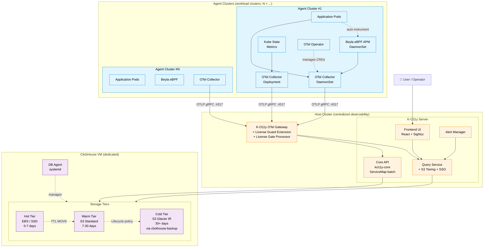

<div align="center">


# K-O11y

**Kubernetes Observability Platform for self-hosted, air-gapped, multi-cluster environments.**

[English](README.md) | [한국어](README.ko.md)

[](https://www.repostatus.org/#wip)
[](https://github.com/Wondermove-Inc/k-o11y-server/blob/main/LICENSE)
[](https://github.com/Wondermove-Inc/k-o11y-otel-collector/blob/main/LICENSE)
[](https://github.com/Wondermove-Inc/k-o11y/stargazers)
[](https://github.com/Wondermove-Inc/k-o11y-server/releases)

Built on [SigNoz](https://signoz.io/), [OpenTelemetry](https://opentelemetry.io/), [Beyla eBPF](https://grafana.com/oss/beyla-ebpf/), and [ClickHouse](https://clickhouse.com/).

</div>

---

## 📸 Screenshots

<!-- TODO: Add screenshots after setting up demo environment -->
<!-- Suggested order:
  1. Dashboard overview (SigNoz main view)
  2. ServiceMap topology visualization
  3. Distributed tracing waterfall
  4. Log search / explore
  5. Metric dashboard (K8s cluster health)
  6. Alert rules management
-->

_Screenshots coming soon. In the meantime, check out the [SigNoz live demo](https://signoz.io/demo/) — our UI is based on SigNoz._

---

## ✨ Features

- 📊 **Unified Observability** — Metrics, logs, and traces in a single platform
- 🗺️ **ServiceMap** — Microservice dependency topology visualization
- 🔍 **Distributed Tracing** — ClickHouse-based trace storage and query
- ⚡ **Zero-Code Instrumentation** — Auto-instrument apps with [Beyla eBPF](https://grafana.com/oss/beyla-ebpf/)
- 🏷️ **CRD Label Enrichment** — Automatically add Kubernetes CRD labels (e.g. `k8s.rollout.name` for Argo Rollouts) to all telemetry
- 🏢 **Multi-Cluster Native** — 2-tier Host-Agent architecture for fleet observability
- 💾 **S3 3-Tier Storage** — Hot (EBS) → Warm (S3 Standard) → Cold (S3 Glacier IR) automatic tiering
- 🔐 **SSO Tenant Auto-Lock** — JWT-based multi-tenant SSO with automatic workspace binding
- 🔒 **Air-Gapped Ready** — Works in fully offline environments (regulated industries)
- 📦 **Self-Hosted** — Your data never leaves your infrastructure
- 🎫 **License Guard** — RS256 JWT-based license validation with configurable grace period (enterprise distributions)

---

## 🏗️ Architecture

K-O11y uses a **2-tier Host-Agent model**: lightweight Agent collectors in each workload cluster ship telemetry over OTLP to a central Host cluster that stores, queries, and visualizes everything. ClickHouse is co-located on a dedicated VM (not in-cluster) for storage tiering control.



**Data flow**:

1. Apps emit telemetry (or Beyla eBPF auto-instruments — no code changes)
2. OTel Collectors in each Agent cluster enrich with K8s + CRD labels, batch, and forward via OTLP gRPC
3. Host's K-O11y Gateway validates license (RS256 JWT), gates data through License Gate Processor, and persists to ClickHouse
4. ClickHouse on a dedicated VM tiers data Hot → Warm → Cold automatically; a systemd DB Agent manages S3 lifecycle and Glacier backups
5. Users explore via SigNoz-based UI

---

## 🎯 Why K-O11y?

K-O11y exists to serve a specific gap: **teams who need SigNoz-grade observability but cannot use SaaS** — regulated industries, air-gapped environments, multi-cluster fleets, or teams wary of vendor lock-in.

| Need | SaaS (Datadog, etc.) | DIY (Prom + Grafana + Jaeger + Loki) | K-O11y |
|------|---|---|---|
| Self-hosted | ❌ | ✅ | ✅ |
| Air-gapped | ❌ | ⚠️ painful | ✅ |
| Multi-cluster (Host-Agent) | ✅ (if you pay) | ⚠️ DIY federation | ✅ built-in |
| Metrics + Logs + Traces unified | ✅ | ❌ 4 tools | ✅ |
| eBPF auto-instrumentation | partial | ⚠️ DIY | ✅ Beyla integrated |
| Cost predictability | ❌ usage-based | ✅ | ✅ |
| Operational complexity | ✅ low | ❌ high | ⚠️ medium |

**Best fit for**: on-premise K8s fleets, government / defense / finance / healthcare, edge deployments, cost-sensitive teams moving off Datadog.

---

## 🚀 Quick Start

> Full Host + Agent installation is a **6-step process** using Go CLI tools and Helm.
> Pre-built Docker images and OCI-registry Helm charts are not yet published (see [Roadmap](#-roadmap)), so you'll need to push the built images to your own OCI registry (GHCR, Harbor, etc.) for now.

### Prerequisites

- **ClickHouse VM**: Ubuntu 22.04 LTS, SSH access with sudo, 8+ vCPU, 32GB+ RAM
- **Host K8s cluster**: Kubernetes 1.28+, Helm 3.12+, kubectl
- **Agent K8s cluster(s)**: Kubernetes 1.28+, Linux kernel 5.8+ (for Beyla eBPF)
- **OCI registry**: Accessible by both clusters
- **Encryption key**: `openssl rand -hex 32` (stored as `K_O11Y_ENCRYPTION_KEY`)

### Minimal Flow (6 Steps)

```bash
# ── 1. Install ClickHouse + Keeper on the VM (Go CLI)
./k-o11y-db install --mode ssh \
  --ssh-user <SSH_USER> --ssh-key <SSH_KEY_PATH> \
  --keeper-host <KEEPER_IP> --clickhouse-host <CLICKHOUSE_IP> \
  --clickhouse-password '<CLICKHOUSE_PASSWORD>' \
  --encryption-key <K_O11Y_ENCRYPTION_KEY> --yes

# ── 2. (Optional) Set up TLS for OTel Gateway
./k-o11y-tls setup --mode selfsigned \
  --domain <DOMAIN> --secret-name k-o11y-otel-collector-tls \
  --kube-context <HOST_CONTEXT>

# ── 3. Install Host cluster (Helm)
helm upgrade --install k-o11y-host \
  --kube-context <HOST_CONTEXT> \
  oci://<YOUR_REGISTRY>/charts/k-o11y-host \
  --namespace k-o11y --create-namespace \
  --set externalClickhouse.host=<NLB_DNS_OR_IP> \
  --set externalClickhouse.password='<CLICKHOUSE_PASSWORD>' \
  --set o11yHub.additionalEnvs.K_O11Y_ENCRYPTION_KEY=<ENCRYPTION_KEY>

# ── 4. Apply DDL + install OTel Agent on ClickHouse VM (Go CLI)
./k-o11y-db post-install --mode ssh \
  --clickhouse-host <CLICKHOUSE_IP> \
  --clickhouse-password '<CLICKHOUSE_PASSWORD>' \
  --otel-endpoint <HOST_GATEWAY_IP>:4317 --environment prod

# ── 5. Install cert-manager on Agent cluster (Helm)
helm install cert-manager jetstack/cert-manager \
  --namespace cert-manager --create-namespace \
  --version v1.17.1 --set crds.enabled=true \
  --kube-context <AGENT_CONTEXT> --wait

# ── 6. Install Agent cluster (Helm)
helm upgrade --install k-o11y-agent \
  --kube-context <AGENT_CONTEXT> \
  oci://<YOUR_REGISTRY>/charts/k-o11y-agent \
  --namespace k-o11y --create-namespace \
  --set global.clusterName=<CLUSTER_NAME> \
  --set global.deploymentEnvironment=prod \
  --set k-o11y-otel-agent.otelCollectorEndpoint=<HOST_GATEWAY_IP>:4317 \
  --wait --timeout 25m
```

**Full reference** (including all flags, TLS variants, and bastion SSH mode): [k-o11y-install/README.md](https://github.com/Wondermove-Inc/k-o11y-install#readme)

---

## 📦 Components

K-O11y is composed of four repositories, included here as git submodules.

| Component | Repository | Description |
|-----------|-----------|-------------|
| 🧠 **Server** | [k-o11y-server](https://github.com/Wondermove-Inc/k-o11y-server) | Self-hosted observability backend. Monorepo with `packages/core` (Go API for ServiceMap and S3 Tiering, Go 1.24 + Gin + ClickHouse) and `packages/signoz` (SigNoz fork with React frontend and Query Service). |
| 📦 **Install** | [k-o11y-install](https://github.com/Wondermove-Inc/k-o11y-install) | 6 Helm charts (`k-o11y-host`, `k-o11y-agent`, and 4 sub-charts: `k-o11y-otel-agent`, `k-o11y-apm-agent`, `k-o11y-ksm`, `k-o11y-otel-operator`) + 2 Go CLI tools: `k-o11y-db` (ClickHouse VM installer, DDL apply, S3 tiering) and `k-o11y-tls` (cert-manager setup: existing / self-signed / private-CA / Let's Encrypt). |
| 📡 **OTel Collector** | [k-o11y-otel-collector](https://github.com/Wondermove-Inc/k-o11y-otel-collector) | Custom OTel Collector v0.109.0 distribution with **CRD Processor** — automatically adds Kubernetes CRD labels (e.g. `k8s.rollout.name` for Argo Rollouts) to traces, metrics, and logs via a K8s Informer. Extensible to Knative, KEDA, etc. |
| 🛂 **OTel Gateway** | [k-o11y-otel-gateway](https://github.com/Wondermove-Inc/k-o11y-otel-gateway) | SigNoz OTel Collector v0.129.2 fork with two custom components: **License Guard Extension** (RS256 JWT license validation with 7-day grace period) and **License Gate Processor** (drops telemetry when license is invalid and grace period has expired). |

**Clone with all submodules:**

```bash
git clone --recurse-submodules https://github.com/Wondermove-Inc/k-o11y.git
```

---

## 🛠️ Installation

There are three installation scenarios depending on your setup.

### 1. Full Stack — self-built images (works today) ⚙️

The documented 6-step process above builds on this. You clone each sub-repo, build and push Docker images to **your own OCI registry**, then install via Helm charts that reference your registry.

Sub-repo READMEs contain the full build instructions:
- **Server**: [packages/core](https://github.com/Wondermove-Inc/k-o11y-server/tree/main/packages/core) and [packages/signoz](https://github.com/Wondermove-Inc/k-o11y-server/tree/main/packages/signoz) — build with `go build` / `make go-build-community` / `docker build`
- **OTel Collector**: `make docker` → pushes `ghcr.io/wondermove-inc/k-o11y-otel-collector-contrib:0.109.0.1`
- **OTel Gateway**: `go build -o signoz-otel-collector ./cmd/signozotelcollector` + Docker

### 2. GHCR pre-built images (roadmap) 🚧

Once automated GHCR publishing lands (see [Roadmap](#-roadmap)), installation will be:

```bash
helm install k-o11y oci://ghcr.io/wondermove-inc/charts/k-o11y-host \
  --namespace k-o11y --create-namespace
```

Not yet available.

### 3. Local development

- **Server (core API)**: `cd packages/core && go run cmd/main.go` (requires `CLICKHOUSE_HOST`, `CLICKHOUSE_PORT`, `CLICKHOUSE_DATABASE`)
- **Server (SigNoz backend)**: `cd packages/signoz && make go-run-community`
- **Frontend**: `cd packages/signoz/frontend && yarn install && yarn dev`

---

## 🎬 Demo

Until we ship our own screenshots and a hosted demo, the closest reference is the upstream SigNoz demo (our UI is based on it):

- **SigNoz live demo**: [signoz.io/demo](https://signoz.io/demo/)
- Differences in K-O11y: integrated Beyla eBPF, ServiceMap enhancements, CRD label enrichment via Argo Rollouts support, S3 3-tier storage, 2-tier Host-Agent multi-cluster model, License Guard for enterprise distributions

---

## 🗺️ Roadmap

Not a commitment — a direction. Contributions welcome on any of these.

- [ ] 🐳 **Publish GHCR Docker images** for all 4 components (unblocks one-line install)
- [ ] 📦 **Publish Helm charts to OCI registry** (currently `<YOUR_REGISTRY>` placeholder)
- [ ] 📸 **Record demo screenshots and GIFs**
- [ ] 🏗️ **MkDocs / GitHub Pages documentation site**
- [ ] 🌏 **Translate Korean comments in Go code to English** ([k-o11y-server#1](https://github.com/Wondermove-Inc/k-o11y-server/issues/1), [k-o11y-install#1](https://github.com/Wondermove-Inc/k-o11y-install/issues/1))
- [ ] 🎨 **Architecture diagram in README** ([k-o11y#1](https://github.com/Wondermove-Inc/k-o11y/issues/1))
- [ ] 🧪 **docker-compose.yml for local development**
- [ ] 📚 **Grafana dashboard JSON presets**
- [ ] 🔔 **Prometheus AlertManager rule presets**

---

## 🤝 Contributing

Contributions are welcome — especially on [good first issues](https://github.com/search?q=org%3AWondermove-Inc+label%3A%22good+first+issue%22+is%3Aopen&type=issues).

1. **Find an issue** labeled `good first issue` or `help wanted`
2. **Comment on the issue** to claim it (avoid duplicate work)
3. **Fork, branch, and send a PR** — scope narrowly, describe clearly
4. **Address review feedback** — maintainers will reply within a few days

See [CONTRIBUTING.md](https://github.com/Wondermove-Inc/k-o11y-server/blob/main/CONTRIBUTING.md) in any of the sub-repos for more.

This project follows **passive maintenance** — PRs and issues are reviewed as time allows. We aim to respond within 7 days but cannot guarantee faster turnaround.

---

## 👥 Contributors

Thanks to everyone who's made K-O11y better.

<a href="https://github.com/Wondermove-Inc/k-o11y/graphs/contributors">
  
</a>

_Contributors shown above are for this umbrella repository. For the full list across all sub-repositories:_
[server](https://github.com/Wondermove-Inc/k-o11y-server/graphs/contributors) ·
[install](https://github.com/Wondermove-Inc/k-o11y-install/graphs/contributors) ·
[otel-collector](https://github.com/Wondermove-Inc/k-o11y-otel-collector/graphs/contributors) ·
[otel-gateway](https://github.com/Wondermove-Inc/k-o11y-otel-gateway/graphs/contributors)

---

## ⭐ Star History

If K-O11y is useful to you, please consider giving it a star — it helps others find the project.

[](https://star-history.com/#Wondermove-Inc/k-o11y&Wondermove-Inc/k-o11y-server&Wondermove-Inc/k-o11y-install&Wondermove-Inc/k-o11y-otel-collector&Wondermove-Inc/k-o11y-otel-gateway&Date)

---

## 📄 License

- **k-o11y-server** and **k-o11y-install**: [MIT License](https://github.com/Wondermove-Inc/k-o11y-server/blob/main/LICENSE) (inherited from SigNoz)
- **k-o11y-otel-collector** and **k-o11y-otel-gateway**: [Apache License 2.0](https://github.com/Wondermove-Inc/k-o11y-otel-collector/blob/main/LICENSE) (inherited from OpenTelemetry)

Forked from [SigNoz](https://github.com/SigNoz/signoz) (MIT) and the [OpenTelemetry Collector](https://github.com/open-telemetry/opentelemetry-collector) (Apache 2.0). See [NOTICE](NOTICE) for attribution details.

---

## 💬 Contact

- 🐛 **Bug reports & feature requests**: [GitHub Issues](https://github.com/Wondermove-Inc/k-o11y/issues)
- 💭 **Questions & discussions**: Open an issue (GitHub Discussions coming soon)
- 🌐 **Website**: [wondermove.net](https://wondermove.net)

---

<div align="center">

**Built and maintained by [Wondermove](https://wondermove.net)**

Based on the incredible work of [SigNoz](https://signoz.io) and the [OpenTelemetry](https://opentelemetry.io) community.

</div>
