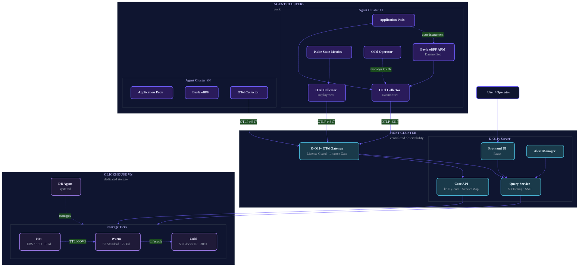

<div align="center">


# K-O11y

**面向自托管、离线隔离、多集群环境的 Kubernetes 可观测性平台**

[English](README.md) | [한국어](README.ko.md) | [日本語](README.ja.md) | [中文](README.zh-CN.md)

[](https://www.repostatus.org/#wip)
[](https://github.com/Wondermove-Inc/k-o11y-server/blob/main/LICENSE)
[](https://github.com/Wondermove-Inc/k-o11y-otel-collector/blob/main/LICENSE)
[](https://github.com/Wondermove-Inc/k-o11y/stargazers)
[](https://github.com/Wondermove-Inc/k-o11y-server/releases)

基于 [OpenTelemetry](https://opentelemetry.io/) · [Beyla eBPF](https://grafana.com/oss/beyla-ebpf/) · [ClickHouse](https://clickhouse.com/) 构建

<br/>


</div>

---

K-O11y 是一个自托管的 Kubernetes 可观测性平台，可统一管理多个集群的指标、日志和链路追踪。基于 OpenTelemetry + Beyla eBPF，采用 2 层 Host–Agent 架构，以 ClickHouse 作为存储后端，并提供自动 **Hot → Warm (S3) → Cold (Glacier IR)** 分层存储。

---

## 📸 截图

<div align="center">
  
  <p><em>统一集群洞察 — 在单一视图中查看 CPU、内存、Pod、节点及趋势图表。</em></p>
</div>

### 🔭 一站式可观测性

<table>
  <tr>
    <td width="50%" valign="top">
      
      <p align="center"><strong>📝 Logs</strong><br/><sub>频率图表 + 严重级别过滤 + 全文搜索</sub></p>
    </td>
    <td width="50%" valign="top">
      
      <p align="center"><strong>🔍 Traces</strong><br/><sub>跨服务分布式链路追踪 + 丰富过滤条件</sub></p>
    </td>
  </tr>
  <tr>
    <td width="50%" valign="top">
      
      <p align="center"><strong>📈 APM</strong><br/><sub>p50/p90/p99 延迟、Apdex 及关键操作</sub></p>
    </td>
    <td width="50%" valign="top">
      
      <p align="center"><strong>🏗️ Infrastructure</strong><br/><sub>Pod 级别指标、日志、链路追踪与事件</sub></p>
    </td>
  </tr>
</table>

### 🐞 Exceptions

<div align="center">
  
  <p><em>捕获附带 <code>spanID</code> 和 <code>traceID</code> 的堆栈跟踪 — 可直接从异常跳转至对应的分布式链路。</em></p>
</div>

### 💾 Data Lifecycle

<div align="center">
  
  <p><em>按信号类型配置数据保留策略，通过 UI 即可设置原生 <strong>Hot → Warm (S3) → Cold (Glacier IR)</strong> 分层。</em></p>
</div>

### 🔔 Alerts

<div align="center">
  
  <p><em>Alertmanager 配置、SMTP 及可插拔通知渠道 — 均可通过 UI 进行配置。</em></p>
</div>

---

## ✨ 功能特性

- 📊 **统一可观测性** — 在单一平台中管理指标、日志和链路追踪
- 🗺️ **ServiceMap** — 微服务依赖拓扑可视化
- 🔍 **分布式链路追踪** — 基于 ClickHouse 的链路存储与查询
- ⚡ **零代码埋点** — 通过 [Beyla eBPF](https://grafana.com/oss/beyla-ebpf/) 自动插桩，无需修改代码
- 🏷️ **CRD 标签自动增强** — 自动将 Kubernetes CRD 标签（例如 Argo Rollouts 的 `k8s.rollout.name`）添加到所有遥测数据
- 🏢 **多集群原生支持** — 2 层 Host-Agent 架构，实现集群群组的统一可观测性
- 💾 **S3 三层存储** — Hot (EBS) → Warm (S3 Standard) → Cold (S3 Glacier IR) 自动分层
- 🔐 **SSO 租户自动绑定** — 基于 JWT 的多租户 SSO + 自动工作区绑定
- 🔒 **离线隔离就绪** — 支持完全离线环境（适用于监管行业）
- 📦 **自托管** — 数据不会离开您的基础设施
- 🎫 **License Guard** — 基于 RS256 JWT 的许可证验证 + 可配置宽限期（企业发行版）

---

## 🎯 为什么选择 K-O11y？

K-O11y 致力于填补特定空白：**需要生产级可观测性但无法使用 SaaS 的团队** — 监管行业、离线隔离环境、多集群运营团队，或希望规避厂商锁定的团队。

| 需求 | SaaS（Datadog 等） | DIY（Prom + Grafana + Jaeger + Loki） | K-O11y |
|------|---|---|---|
| 自托管 | ❌ | ✅ | ✅ |
| 离线隔离 | ❌ | ⚠️ 困难 | ✅ |
| 多集群（Host-Agent） | ✅（付费） | ⚠️ DIY 联邦 | ✅ 内置支持 |
| 指标 + 日志 + 链路追踪统一 | ✅ | ❌ 需 4 个工具 | ✅ |
| eBPF 自动埋点 | 部分支持 | ⚠️ DIY | ✅ 集成 Beyla |
| 成本可预测性 | ❌ 按用量计费 | ✅ | ✅ |
| 运维复杂度 | ✅ 低 | ❌ 高 | ⚠️ 中 |

**最适合**: 本地化 K8s 集群运营团队、政府 / 国防 / 金融 / 医疗机构、边缘部署、正在考虑从 Datadog 迁移的成本敏感团队。

---

## 🎬 演示

<div align="center">

https://github.com/user-attachments/assets/097a958c-0179-4676-85d9-5de9d649c711

</div>

---

## 🏗️ 架构

K-O11y 采用 **2 层 Host-Agent 模型**：每个工作负载集群中的轻量级 Agent 采集器通过 OTLP 将遥测数据发送至中央 Host 集群，由 Host 集群负责存储、查询和可视化。ClickHouse 部署在专用 VM 上（集群外部），以便于存储分层管理。



**数据流**:

1. 应用发出遥测数据（或由 Beyla eBPF 自动插桩 — 无需修改代码）
2. 各 Agent 集群中的 OTel Collector 附加 K8s + CRD 标签，批处理后通过 OTLP gRPC 转发
3. Host 的 K-O11y Gateway 验证许可证（RS256 JWT），经 License Gate Processor 处理后持久化至 ClickHouse
4. 专用 VM 上的 ClickHouse 自动将数据分层存储 Hot → Warm → Cold；systemd DB Agent 管理 S3 Lifecycle 和 Glacier 备份
5. 用户通过 Web UI 进行数据探索

---

## 📦 组件

K-O11y 由四个仓库组成，以 git submodule 的形式包含在本仓库中。

| 组件 | 仓库 | 说明 |
|-----------|-----------|-------------|
| 🧠 **Server** | [k-o11y-server](https://github.com/Wondermove-Inc/k-o11y-server) | 自托管可观测性后端。Monorepo 结构：`packages/core`（ServiceMap 和 S3 Tiering Go API，Go 1.24 + Gin + ClickHouse）和 `packages/signoz`（React 前端和 Query Service）。 |
| 📦 **Install** | [k-o11y-install](https://github.com/Wondermove-Inc/k-o11y-install) | 6 个 Helm chart（`k-o11y-host`、`k-o11y-agent` 及 4 个子 chart：`k-o11y-otel-agent`、`k-o11y-apm-agent`、`k-o11y-ksm`、`k-o11y-otel-operator`）+ 2 个 Go CLI 工具：`k-o11y-db`（ClickHouse VM 安装、DDL 应用、S3 分层）和 `k-o11y-tls`（cert-manager 配置：existing / self-signed / private-CA / Let's Encrypt）。 |
| 📡 **OTel Collector** | [k-o11y-otel-collector](https://github.com/Wondermove-Inc/k-o11y-otel-collector) | OTel Collector v0.109.0 自定义发行版，内置 **CRD Processor** — 通过 K8s Informer 自动将 Kubernetes CRD 标签（例如 Argo Rollouts 的 `k8s.rollout.name`）添加到链路追踪、指标和日志中。可扩展支持 Knative、KEDA 等。 |
| 🛂 **OTel Gateway** | [k-o11y-otel-gateway](https://github.com/Wondermove-Inc/k-o11y-otel-gateway) | 包含两个自定义组件的 OTel Collector 发行版：**License Guard Extension**（RS256 JWT 许可证验证 + 7 天宽限期）和 **License Gate Processor**（许可证无效且宽限期结束时丢弃遥测数据）。 |

**包含所有子模块的克隆命令:**

```bash
git clone --recurse-submodules https://github.com/Wondermove-Inc/k-o11y.git
```

---

## 🚀 快速开始

> 完整的 Host + Agent 安装是使用 Go CLI 工具和 Helm 的 **6 步流程**。
> 预构建的 Docker 镜像和 OCI Registry Helm chart 尚未发布（参见[路线图](#-路线图)），因此目前需要将构建好的镜像推送到您自己的 OCI Registry（GHCR、Harbor 等）。

### 前置条件

- **ClickHouse VM**: Ubuntu 22.04 LTS，具有 sudo 权限的 SSH 访问，8+ vCPU，32GB+ RAM
- **Host K8s 集群**: Kubernetes 1.28+，Helm 3.12+，kubectl
- **Agent K8s 集群**: Kubernetes 1.28+，Linux 内核 5.8+（用于 Beyla eBPF）
- **OCI Registry**: 两个集群均可访问
- **加密密钥**: `openssl rand -hex 32`（存储为 `K_O11Y_ENCRYPTION_KEY`）

### 最小安装流程（6 步）

```bash
# ── 1. 在 VM 上安装 ClickHouse + Keeper（Go CLI）
./k-o11y-db install --mode ssh \
  --ssh-user <SSH_USER> --ssh-key <SSH_KEY_PATH> \
  --keeper-host <KEEPER_IP> --clickhouse-host <CLICKHOUSE_IP> \
  --clickhouse-password '<CLICKHOUSE_PASSWORD>' \
  --encryption-key <K_O11Y_ENCRYPTION_KEY> --yes

# ── 2.（可选）为 OTel Gateway 配置 TLS
./k-o11y-tls setup --mode selfsigned \
  --domain <DOMAIN> --secret-name k-o11y-otel-collector-tls \
  --kube-context <HOST_CONTEXT>

# ── 3. 安装 Host 集群（Helm）
helm upgrade --install k-o11y-host \
  --kube-context <HOST_CONTEXT> \
  oci://<YOUR_REGISTRY>/charts/k-o11y-host \
  --namespace k-o11y --create-namespace \
  --set externalClickhouse.host=<NLB_DNS_OR_IP> \
  --set externalClickhouse.password='<CLICKHOUSE_PASSWORD>' \
  --set o11yHub.additionalEnvs.K_O11Y_ENCRYPTION_KEY=<ENCRYPTION_KEY>

# ── 4. 应用 DDL + 在 ClickHouse VM 上安装 OTel Agent（Go CLI）
./k-o11y-db post-install --mode ssh \
  --clickhouse-host <CLICKHOUSE_IP> \
  --clickhouse-password '<CLICKHOUSE_PASSWORD>' \
  --otel-endpoint <HOST_GATEWAY_IP>:4317 --environment prod

# ── 5. 在 Agent 集群上安装 cert-manager（Helm）
helm install cert-manager jetstack/cert-manager \
  --namespace cert-manager --create-namespace \
  --version v1.17.1 --set crds.enabled=true \
  --kube-context <AGENT_CONTEXT> --wait

# ── 6. 安装 Agent 集群（Helm）
helm upgrade --install k-o11y-agent \
  --kube-context <AGENT_CONTEXT> \
  oci://<YOUR_REGISTRY>/charts/k-o11y-agent \
  --namespace k-o11y --create-namespace \
  --set global.clusterName=<CLUSTER_NAME> \
  --set global.deploymentEnvironment=prod \
  --set k-o11y-otel-agent.otelCollectorEndpoint=<HOST_GATEWAY_IP>:4317 \
  --wait --timeout 25m
```

**完整参考文档**（含所有标志、TLS 变体和堡垒机 SSH 模式）: [k-o11y-install/README.md](https://github.com/Wondermove-Inc/k-o11y-install#readme)

---

## 🛠️ 安装

根据您的环境，有三种安装方案。

### 1. 完整栈 — 自行构建镜像（当前可用）⚙️

上述 6 步流程即采用此方案。克隆各子仓库，将 Docker 镜像构建并推送到**您自己的 OCI Registry**，然后通过引用该 Registry 的 Helm chart 进行安装。

各子仓库的 README 中包含完整的构建说明:
- **Server**: [packages/core](https://github.com/Wondermove-Inc/k-o11y-server/tree/main/packages/core) 和 [packages/signoz](https://github.com/Wondermove-Inc/k-o11y-server/tree/main/packages/signoz) — 使用 `go build` / `make go-build-community` / `docker build`
- **OTel Collector**: `make docker` → 推送至 `ghcr.io/wondermove-inc/k-o11y-otel-collector-contrib:0.109.0.1`
- **OTel Gateway**: `go build -o signoz-otel-collector ./cmd/signozotelcollector` + Docker

### 2. GHCR 预构建镜像（路线图）🚧

一旦自动化 GHCR 发布功能上线（参见[路线图](#-路线图)），安装将变得如此简单:

```bash
helm install k-o11y oci://ghcr.io/wondermove-inc/charts/k-o11y-host \
  --namespace k-o11y --create-namespace
```

当前尚不可用。

### 3. 本地开发

- **Server（core API）**: `cd packages/core && go run cmd/main.go`（需要 `CLICKHOUSE_HOST`、`CLICKHOUSE_PORT`、`CLICKHOUSE_DATABASE`）
- **Server（后端）**: `cd packages/signoz && make go-run-community`
- **Frontend**: `cd packages/signoz/frontend && yarn install && yarn dev`

---

## 🗺️ 路线图

这是方向，而非承诺。欢迎就任何议题做出贡献。

- [ ] 🐳 **发布所有 4 个组件的 GHCR Docker 镜像**（实现一行命令安装）
- [ ] 📦 **发布 Helm chart 到 OCI Registry**（当前为 `<YOUR_REGISTRY>` 占位符）
- [ ] 🏗️ **MkDocs / GitHub Pages 文档站点**
- [ ] 🌏 **将 Go 代码中的韩语注释翻译为英语**（[k-o11y-server#1](https://github.com/Wondermove-Inc/k-o11y-server/issues/1)，[k-o11y-install#1](https://github.com/Wondermove-Inc/k-o11y-install/issues/1)）
- [ ] 🧪 **用于本地开发的 docker-compose.yml**
- [ ] 📚 **Grafana 仪表盘 JSON 预设**
- [ ] 🔔 **Prometheus AlertManager 告警规则预设**

---

## 🤝 贡献

欢迎贡献，特别是 [good first issue](https://github.com/search?q=org%3AWondermove-Inc+label%3A%22good+first+issue%22+is%3Aopen&type=issues) 标签的议题。

1. **找到议题** — 查找带有 `good first issue` 或 `help wanted` 标签的议题
2. **在议题上留言** — 声明认领以避免重复工作
3. **Fork、创建分支、提交 PR** — 范围精准，描述清晰
4. **处理审查反馈** — 维护者将在数天内回复

更多详情请参阅任意子仓库中的 [CONTRIBUTING.md](https://github.com/Wondermove-Inc/k-o11y-server/blob/main/CONTRIBUTING.md)。

本项目采用**被动维护**模式 — PR 和议题将在时间允许时进行审查。我们力争在 7 天内响应，但无法保证更快的周转时间。

---

## 👥 贡献者

感谢所有让 K-O11y 变得更好的人。

<a href="https://github.com/Wondermove-Inc/k-o11y/graphs/contributors">
  
</a>

_上方贡献者列表仅针对此 umbrella 仓库。所有子仓库的完整贡献者列表:_
[server](https://github.com/Wondermove-Inc/k-o11y-server/graphs/contributors) ·
[install](https://github.com/Wondermove-Inc/k-o11y-install/graphs/contributors) ·
[otel-collector](https://github.com/Wondermove-Inc/k-o11y-otel-collector/graphs/contributors) ·
[otel-gateway](https://github.com/Wondermove-Inc/k-o11y-otel-gateway/graphs/contributors)

---

## ⭐ Star History

如果 K-O11y 对您有帮助，请考虑给项目点个 Star — 这有助于更多人发现该项目。

[](https://star-history.com/#Wondermove-Inc/k-o11y&Wondermove-Inc/k-o11y-server&Wondermove-Inc/k-o11y-install&Wondermove-Inc/k-o11y-otel-collector&Wondermove-Inc/k-o11y-otel-gateway&Date)

---

## 📄 许可证

- **k-o11y-server** 和 **k-o11y-install**: [MIT License](https://github.com/Wondermove-Inc/k-o11y-server/blob/main/LICENSE)（继承自 SigNoz）
- **k-o11y-otel-collector** 和 **k-o11y-otel-gateway**: [Apache License 2.0](https://github.com/Wondermove-Inc/k-o11y-otel-collector/blob/main/LICENSE)（继承自 OpenTelemetry）

Fork 自 [SigNoz](https://github.com/SigNoz/signoz)（MIT）和 [OpenTelemetry Collector](https://github.com/open-telemetry/opentelemetry-collector)（Apache 2.0）。归属详情请参阅 [NOTICE](NOTICE)。

---

## 💬 联系方式

- 🐛 **Bug 报告 & 功能请求**: [GitHub Issues](https://github.com/Wondermove-Inc/k-o11y/issues)
- 💭 **问题 & 讨论**: 提交一个 Issue（GitHub Discussions 即将上线）
- 🌐 **网站**: [www.skuberplus.com](https://www.skuberplus.com)

---

<div align="center">

**由 [Wondermove](https://www.skuberplus.com) 构建与维护**

</div>
